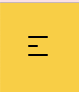

## Jij

  
uitwerken voor kick-off werkgroep

  ### Auteur:
  Michelle Akkermans

  #### Je startniveau:
  Blauw

  #### Je focus:
  Surface plane
 

## Je website

  
uitwerken voor kick-off werkgroep

  ### Je opdracht:
  https://www.vangoghmuseum.nl/en

  #### Screenshot(s) van de eerste pagina (small screen): 
  hier de naam van de pagina  
  

  #### Screenshot(s) van de tweede pagina (small screen):
  hier de naam van de pagina  
 
 

## Toegankelijkheidstest 1/2 (week 1)

  
uitwerken na test in 1e werkgroep

  ### Bevindingen
  Lijst met je bevindingen die in de test naar voren kwamen:
  Wat vooral naar voren kwam in de test is dat de site best goed gemaakt is en dat het zeker iets is waar ik naar moet streven als het gaat om accesability.

  #### Screenreader
  Hier korte omschrijving (met indien nodig afbeeldingen)
  De screenreader deed alles netjes oplezen van de site. Dit is iets wat wil zelf ook echt wil doen met mijn site en ik kan dit dus ook echt als voorbeeld gebruiken.

  #### Muis en Toetsenbord 
  Hier korte omschrijving (met indien nodig afbeeldingen)
  - Met de muis is de site heel goed en duidelijk te bedienen. Elke button heeft een duidelijke active state en hoover.
  - Met het toetsenbord is dit hetzelfde geval, lijkt het wel alsof je over de artiekelen heen skipt als je van de 2e en 3e gaat.
 

  #### Motoriek (shocks, elastiekjes)
  Hier korte omschrijving (met indien nodig afbeeldingen)
  Met de elastiekjes was het wat lastiger om de website te gebruiken, zeker als je je wijsvinger veel gebruikt. Zeker met de MacBook trackpad ga je makkelijk naar de andere desktop pagina's maar voor de site zelf is het best prima te doen.
  Hier een omschrijving van hoe het opgelost kan worden (met indien nodig afbeeldingen)
  Dit kan opgelost worden door de links groot genoeg te maken dat je niet al te veel precisie nodig hebt om de website te gebruiken.

  #### Visueel (brillen, contrast, kleurenblind, dark/light). 
  Hier korte omschrijving (met indien nodig afbeeldingen)
  - De site heeft nog geen dark modes, dit is iets wat ik zou kunnen toevoegen.
  - Met de brillen was de font wat lastiger te lezen aangezien deze best dun is. Hier zou ik dus wat aan kunnen veranderen.
  - Er zit veel contrast tussen alle kleuren waardoor kleurenblinden mensen geen problemen zouden moeten hebben met de kleuren van de site.
 

## Breakdownschets (week 1)

  
uitwerken na afloop 2e werkgroep

  ### de hele pagina: 
  

  ### dynamisch deel (bijv menu): 
  

  ### wellicht nog een dynamisch deel (bijv filter): 
  

## Voortgang 1 (week 2)

  
uitwerken voor 1e voortgang

  ### Stand van zaken
  hier dit ging goed & dit was lastig (neem ook screenshots op van delen van je website en code)
  - Basic HTML opzetten ging goed, het was ff zoeken naar alle termen maar daarna ging het wel prima.
  - Wat nog lastig is, is de basics van de css, vooral de plaatjes. (img achter tekst en de positionering van zowel tekst als img.)
  Vragen: Wat de beste manier is om die images te positioneren? (grid,flexbox of toch een andere manier.)

  ### Agenda voor meeting
  samen met je groepje opstellen

  | Allemaal       | Joep               | Sten         | Michelle         |
  | ---            | ---                | ---          | ---              |
  | dit bespreken  | en dit             | en ik dit    | en dan ik dat    |
  | en dat ook nog | dit als er tijd is | nog een punt | dit wil ik zeker |
  | HTML check     | Hamburger menu     | Carousel     | Plaatjes positionering|

  ### Verslag van meeting
  hier na afloop snel de uitkomsten van de meeting vastleggen

  - Html was goed, op wat kleine dingetjes na.
  - Uitleg over images achter de tekst krijgen gehad.
  - uitleg over beste manier van pijltjes bij de <a> gehad.
  

## Voortgang 2 (week 3)

  
uitwerken voor 2e voortgang

  ### Stand van zaken
  hier dit ging goed & dit was lastig (neem ook screenshots op van delen van je website en code)
  - Lessen hebben veel duidelijk gemaakt.
  - Door hulp van Sanne goed opweg.

  ### Agenda voor meeting
  samen met je groepje opstellen

  | Allemaal       | Sten               | Joep         | Michelle        |
  | ---            | ---                | ---          | ---              |
  | dit bespreken  | en dit             | en ik dit    | en dan ik dat    |
  | en dat ook nog | dit als er tijd is | nog een punt | dit wil ik zeker |
  | Werk check     | Button die menu uitklapt| Interval op scroll| Border radius werkt niet|

  ### Verslag van meeting
  hier na afloop snel de uitkomsten van de meeting vastleggen

  - Goed opweg
  - Border radius was te klein, na groter te maken deed hij het. 

## Toegankelijkheidstest 2/2 (week 4)

  
uitwerken na test in 8e werkgroep

  ### Bevindingen
  Lijst met je bevindingen die in de test naar voren kwamen (geef ook aan wat er verbeterd is):
  - Mijn website is al erg toegankelijk. 
  - Kleine details veranderen zoals een h3 naar een a etc. 
  - belangrijkste dingen die nog niet kloppen had ik nog niet gemaakt. 

  #### Screenreader
  Hier korte omschrijving (met indien nodig afbeeldingen)
  

  Hier een omschrijving van hoe het opgelost kan worden (met indien nodig afbeeldingen)

  #### Muis en Toetsenbord 
  Hier korte omschrijving (met indien nodig afbeeldingen)
  States nog toevoegen. (Menu etc) {hoover, focus, active}

  Hier een omschrijving van hoe het opgelost kan worden (met indien nodig afbeeldingen)
2e pagina h3 moet a zijn. 

  #### Visueel (brillen, contrast, kleurenblind, dark/light). 
  Hier korte omschrijving (met indien nodig afbeeldingen)
  Kleurenblind: De website is goed accesible. Goede contrast kleuren gebruikt, ook in de dark mode.  Ook met blurred vision is het alle tekst nog prima te lezen. 
  Dark mode: De oude dark mode die ik nog wil gaan namaken werkt niet met het systeem mee. Dit zou beter kunnen deze keer.
  

  Hier een omschrijving van hoe het opgelost kan worden (met indien nodig afbeeldingen)
  Een nieuwe dark mode maken ipv de oud versie namaken. 

## Voortgang 3 (week 4)

  
uitwerken voor 3e voortgang

  ### Stand van zaken
  Het maken van de tweede pagina ging heel soepel. Alleen de images moeten nog even in de juiste maat op de pagina gezet worden en een paar andere klein dingetjes.  

  ### Agenda voor meeting
  samen met je groepje opstellen

  | Michelle       | Michelle           | Joep         | student 4        |
  | ---            | ---                | ---          | ---              |
  | dit bespreken  | en dit             | en ik dit    | en dan ik dat    |
  | en dat ook nog | dit als er tijd is | nog een punt | dit wil ik zeker |
  | Plaatjes juiste maat maken | button font size veranderen | Probleem met veranderend plaatjes | ...              |

  ### Verslag van meeting
  hier na afloop snel de uitkomsten van de meeting vastleggen

  - Kleine foutjes uit code gehaald.
  - Uitleg over de object fit voor plaatjes.
  - Button font size is nu gefixt. 

## Eindgesprek (week 5)

  
uitwerken voor eindgesprek

  ### Je uitkomst - karakteristiek screenshots:
  
  

  ### Dit ging goed/Heb ik geleerd: 
  Korte omschrijving met plaatjes

  

  ### Dit was lastig/Is niet gelukt:
  Korte omschrijving met plaatjes

  

## Bronnenlijst

  
continu bijhouden terwijl je werkt

  Nb. Wees specifiek ('css-tricks' als bron is bijv. niet specifiek genoeg).

  1. bron 1
  2. bron 2
  3. ...

